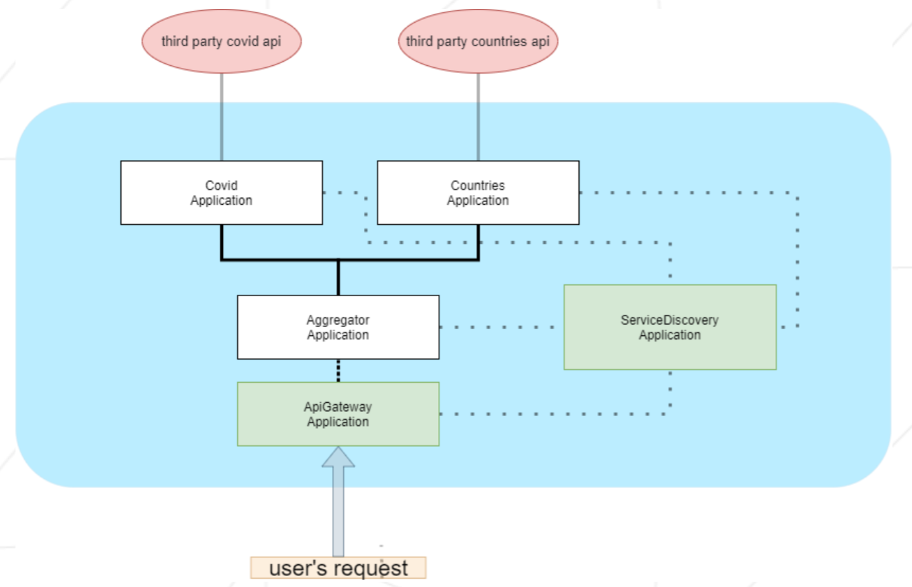

## 1. Application description:
1. Application architecture



2. This project use two third-party api:
   * COVID-19 statistic (see [docs](https://restcountries.com))
   * Countries information (see [docs](https://covid-api.com/api/))
3. Project detailed information (see [en.subject.pdf](files/en.subject.pdf))

---

## 2. Program requirements:
- #### maven
- #### java 8

---

## 3. Run program:
1) Adjust builder settings (see [build.sh](build.sh))
2) Run app: 
```shell
bash build.sh
```
